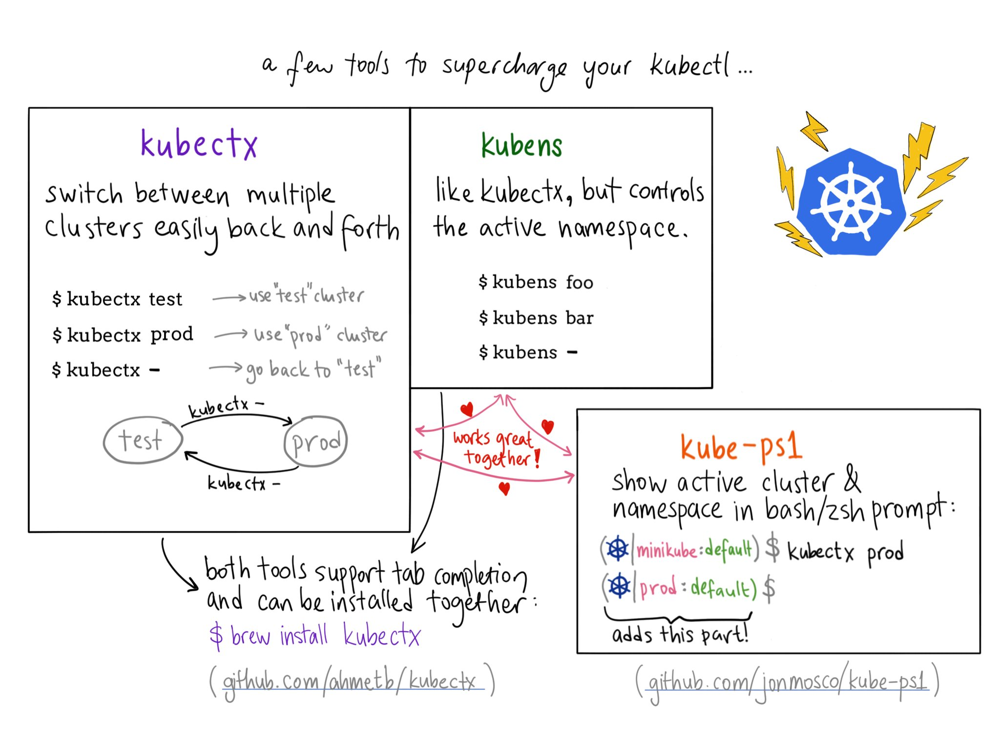

# kubectl in action

_Or: How to use your Kubernetes remote control_

This is a talk at [Pre-FOSDEM warmup with Kubernetes](https://www.meetup.com/Brussels-Kubernetes-Meetup/events/245974093/) at Brussels Kubernetes Meetup, 2018-02-02.

Kubernetes comes with kubectl, a CLI that allows you to interact with your cluster, supporting operations from config to managing workloads to administrative tasks. In this talk you'll learn everything you need to know getting the most out of kubectl and beyond.

## Setup

```
$ kubectl config
```

## Docs and config

What was that field in the manifest again?

```
$ kubectl explain statefulset.spec.template.spec
```

List contexts:

```
$ kubectl config get-contexts
```

## Workloads

Simple jump pod:

```
$ kubectl run -i -t --rm jump --image=quay.io/mhausenblas/jump:v0.1 -- sh
```

Name of pod(s) labelled with `app=example`:

```
$ kubectl get po -l=app=example -o=custom-columns=:metadata.name --no-headers
```

## Accessing the API

```
$ kubectl proxy
```

### RBAC

Can a certain SA list pods?

```
$ kubectl auth can-i list pods --as=system:serviceaccount:sec:myappsa
```

Create rolebinding for an SA in a specified namespace and just do a dry run:

```
$ kubectl create rolebinding podreaderbinding --role=sec:podreader --serviceaccount=sec:myappsa --namespace=sec --dry-run=true -o=yaml -n=sec
```

## Debugging

```
$ kubectl get events
$ kubectl logs
```

## Tips and tricks

- Install and use [auto-complete](https://kubernetes.io/docs/tasks/tools/install-kubectl/#enabling-shell-autocompletion)
- set `KUBE_EDITOR` to your favorite editor

## Tooling

Extend and enhance `kubectl` with:

- [jonmosco/kube-ps1](https://github.com/jonmosco/kube-ps1)
- [ahmetb/kubectx](https://github.com/ahmetb/kubectx)
- [cloudnativelabs/kube-shell](https://github.com/cloudnativelabs/kube-shell)
- [nii236/kk](https://github.com/nii236/kk)
- [CanopyTax/ckube](https://github.com/CanopyTax/ckube)
- [kubed.sh](http://kubed.sh/)



Source: [Ahmet Alp Balkan](https://twitter.com/ahmetb/status/949064018483802112) on Twitter 01/2018.


## Further reading & watching

- [Troubleshoot Kubernetes Deployments](https://docs.bitnami.com/kubernetes/how-to/troubleshoot-kubernetes-deployments/)
- [What happens when you do kubectl run](https://github.com/jamiehannaford/what-happens-when-k8s/blob/master/README.md)
- [Kubernetes kubectl Tips and Tricks](https://coreos.com/blog/kubectl-tips-and-tricks)
- [Some things you didn’t know about kubectl](http://blog.kubernetes.io/2015/10/some-things-you-didnt-know-about-kubectl_28.html)
